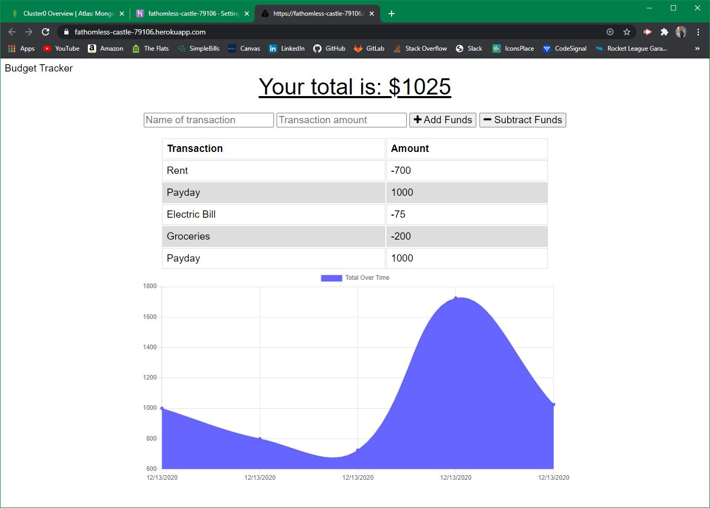

# Budget Tracker

## Description
Budget Tracker allows users to track their budget and get an overview of spending habits. It does this by allowing users to enter transactions that will either add to or subtract from the account total. Once a transaction has been processed, the balance history graph will update to show this latest transaction. If there is no internet conection, a completed transaction will be stored and processed once an internet connection is reestablished.<br>Deployed Application: https://fathomless-castle-79106.herokuapp.com/

  ##
  
  
  ## Installation
  Clone repo and run:
  ```
  npm i
  ```

  ## Usage
  Run the command below to start the server, then open the browser to localhost:3001:
  ```
  npm start
  ```

  ## Technologies Used
  Mongoose, Morgan, Express, Compression

  ## License
  ISC

  ## Contributors
  Joseph DeFelice

  ## Contact
  If you have any questions, contact the author directly at defelicejoseph@outlook.com.